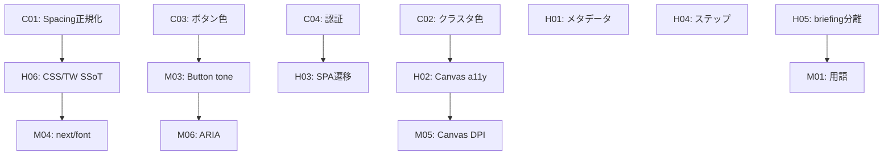

# 是正要件定義書（コードレベル仕様）

| メタ情報 | |
|---|---|
| 文書ID | `REQ-REM-2026-001` |
| 作成日 | 2026-02-08 |
| 対象リポジトリ | `LLM-SFPrototyping` |
| 根拠文書 | `docs/requirement.md`, `docs/design/design_tokens.md`, `docs/design/ui_ux_design.md` |
| ステータス | **DRAFT — レビュー待ち** |

---

## 1. 目的

2026-02-08 監査で検出した 16 件の設計不適合に対し、**コードレベルで検証可能な是正要件**を定義する。

各要件: 不適合定義 → 是正コード（Before/After diff）→ 受け入れ基準 → 影響ファイル一覧

---

## 2. Critical 要件

---

### REM-C01: Tailwind スペーシングスケールの正規化

**不適合箇所**: `tailwind.config.js` L49–58

現行は `theme.extend.spacing` でデフォルトスケールを上書きし、`p-3 = 16px`（本来 12px）等の乖離を生じている。

#### Before → After: `tailwind.config.js`

```diff
 // tailwind.config.js L7–76
  theme: {
    extend: {
      // ... colors, fontFamily ...
-     spacing: {
-       '1': '4px',
-       '2': '8px',
-       '3': '16px',
-       '4': '24px',
-       '5': '32px',
-       '6': '48px',
-       '7': '64px',
-       '8': '96px',
-     },
+     spacing: {
+       'grid-1': '8px',
+       'grid-2': '16px',
+       'grid-3': '24px',
+       'grid-4': '32px',
+       'grid-6': '48px',
+       'grid-8': '64px',
+       'grid-12': '96px',
+     },
```

> [!IMPORTANT]
> デフォルトスケール（`1`=`4px`, `2`=`8px`, `3`=`12px`, ...）が復元される。既存の全 spacing ユーティリティが影響を受ける。

#### 既存コードの置換マッピング

現行で `p-3` 等を使っている箇所は本来 `16px` を意図しているため、以下に置換する:

| 現行クラス | 意図した値 | 是正後クラス |
|---|---|---|
| `p-1`, `m-1`, `gap-1` | 4px | `p-1`, `m-1`, `gap-1`（変更なし） |
| `p-2`, `m-2`, `gap-2` | 8px | `p-2`, `m-2`, `gap-2`（変更なし） |
| `p-3`, `m-3`, `gap-3` | 16px | `p-4`, `m-4`, `gap-4` |
| `p-4`, `m-4`, `gap-4` | 24px | `p-6`, `m-6`, `gap-6` |
| `p-5`, `m-5`, `gap-5` | 32px | `p-8`, `m-8`, `gap-8` |
| `p-6`, `m-6`, `gap-6` | 48px | `p-12`, `m-12`, `gap-12` |
| `p-8` | 96px | `p-24` or `p-grid-12` |

#### 影響ファイル（spacing ユーティリティ使用箇所）

全 `app/**/*.tsx` および `components/**/*.tsx`。一括置換は不可（文脈で意図を確認する必要あり）。

#### 受け入れ基準

- [ ] `tailwind.config.js` で `spacing` キーに数値キー (`'1'`–`'8'`) のオーバーライドが存在しない
- [ ] `npx tailwindcss --content ./test.html` で `p-3` → `padding: 0.75rem` (12px) を確認
- [ ] 全ページの余白が `docs/design/design_tokens.md` §4 の 8px グリッドと一致（目視 + スクリーンショット）

---

### REM-C02: 可視化クラスタ色の差別化

**不適合箇所**: `app/(student)/student/session/[sessionId]/visualization/page.tsx` L7–13, L147–166

#### Before → After: クラスタ色定義

```diff
-const CLUSTER_COLORS = [
-  'rgba(255,255,255,0.85)',
-  'rgba(180,180,180,0.85)',
-  'rgba(120,120,120,0.85)',
-  'rgba(200,200,200,0.85)',
-  'rgba(160,160,160,0.85)',
-]
+// 低彩度ニュートラルトーン — CIE ΔE2000 ペアワイズ最小値 ≥ 20
+const CLUSTER_PALETTE = [
+  { fill: 'rgba(180, 200, 220, 0.85)', shape: 'circle'   as const, label: 'グループ A' },
+  { fill: 'rgba(220, 180, 160, 0.85)', shape: 'triangle' as const, label: 'グループ B' },
+  { fill: 'rgba(180, 220, 180, 0.85)', shape: 'square'   as const, label: 'グループ C' },
+  { fill: 'rgba(220, 200, 160, 0.85)', shape: 'diamond'  as const, label: 'グループ D' },
+  { fill: 'rgba(200, 180, 220, 0.85)', shape: 'star'     as const, label: 'グループ E' },
+]
+
+type ClusterShape = typeof CLUSTER_PALETTE[number]['shape']
```

#### Before → After: Canvas 描画ロジック (`visualization/page.tsx` L147–171)

```diff
     // 点の描画
     for (const r of umapResults) {
       const cx = toCanvasX(r.x)
       const cy = toCanvasY(r.y)
       const isMe = r.studentId === myStudentId
-      const radius = isMe ? 8 : 5
-
-      ctx.beginPath()
-      ctx.arc(cx, cy, radius, 0, Math.PI * 2)
-      ctx.fillStyle = isMe ? '#ffffff' : CLUSTER_COLORS[r.cluster % CLUSTER_COLORS.length]
-      ctx.fill()
+      const palette = CLUSTER_PALETTE[r.cluster % CLUSTER_PALETTE.length]
+      ctx.fillStyle = isMe ? '#ffffff' : palette.fill
+
+      if (isMe) {
+        ctx.beginPath()
+        ctx.arc(cx, cy, 8, 0, Math.PI * 2)
+        ctx.fill()
+      } else {
+        drawShape(ctx, palette.shape, cx, cy, 6)
+      }

       if (isMe) {
         ctx.strokeStyle = '#ffffff'
         ctx.lineWidth = 2
         ctx.beginPath()
         ctx.arc(cx, cy, 12, 0, Math.PI * 2)
         ctx.stroke()
       }
     }

-    // 凡例
-    ctx.fillStyle = 'rgba(255,255,255,0.5)'
-    ctx.font = '11px sans-serif'
-    ctx.fillText('● 自分の位置（白い二重丸）', pad, H - 10)
+    // 凡例（色＋形状＋テキスト）
+    const legendY = H - 14
+    const legendX0 = pad
+    ctx.font = '11px sans-serif'
+    CLUSTER_PALETTE.forEach((p, i) => {
+      const lx = legendX0 + i * 120
+      ctx.fillStyle = p.fill
+      drawShape(ctx, p.shape, lx, legendY, 5)
+      ctx.fillStyle = 'rgba(255,255,255,0.6)'
+      ctx.fillText(p.label, lx + 10, legendY + 4)
+    })
+    ctx.fillStyle = 'rgba(255,255,255,0.5)'
+    ctx.fillText('◎ 自分の位置', legendX0 + CLUSTER_PALETTE.length * 120, legendY + 4)
```

#### 新設関数: `drawShape`

```typescript
// visualization/page.tsx に追加
function drawShape(ctx: CanvasRenderingContext2D, shape: ClusterShape, x: number, y: number, r: number) {
  ctx.beginPath()
  switch (shape) {
    case 'circle':
      ctx.arc(x, y, r, 0, Math.PI * 2)
      break
    case 'triangle':
      ctx.moveTo(x, y - r); ctx.lineTo(x - r, y + r); ctx.lineTo(x + r, y + r)
      ctx.closePath()
      break
    case 'square':
      ctx.rect(x - r, y - r, r * 2, r * 2)
      break
    case 'diamond':
      ctx.moveTo(x, y - r); ctx.lineTo(x + r, y); ctx.lineTo(x, y + r); ctx.lineTo(x - r, y)
      ctx.closePath()
      break
    case 'star': {
      for (let i = 0; i < 5; i++) {
        const angle = -Math.PI / 2 + (i * 2 * Math.PI) / 5
        const innerAngle = angle + Math.PI / 5
        ctx.lineTo(x + Math.cos(angle) * r, y + Math.sin(angle) * r)
        ctx.lineTo(x + Math.cos(innerAngle) * (r * 0.45), y + Math.sin(innerAngle) * (r * 0.45))
      }
      ctx.closePath()
      break
    }
  }
  ctx.fill()
}
```

#### 受け入れ基準

- [ ] 5 グループが形状の違いだけで区別可能（モノクロ印刷テスト）
- [ ] 凡例に色＋形状＋テキストが表示される
- [ ] Chromatic Vision Simulator で 3 型色覚を検証

---

### REM-C03: 質問回答ボタンのカラーマッピング是正

**不適合箇所**: `components/ui/Button.tsx` L19–24, `questions/page.tsx` L133–184, `globals.css` L19–21, `tailwind.config.js` L19–21

#### Before → After: CSS 変数 (`globals.css` L19–21)

```diff
-    --student-accent-red: #b71c1c;
-    --student-accent-blue: #1565c0;
-    --student-accent-gray: #505050;
+    /* 回答ボタン — 価値判断を暗示しない中立色 */
+    --student-answer-yes: #6b8299;      /* steel: hsl(210, 18%, 51%) */
+    --student-answer-no: #99806b;       /* tan:   hsl(30, 18%, 51%) */
+    --student-answer-unknown: #808080;  /* gray:  hsl(0, 0%, 50%)   */
+    /* セマンティック用途（エラー表示等）に赤・青を残す */
+    --student-semantic-error: #b71c1c;
+    --student-semantic-info: #1565c0;
```

#### Before → After: Tailwind config (`tailwind.config.js` L19–21)

```diff
-          'accent-red': '#b71c1c',
-          'accent-blue': '#1565c0',
-          'accent-gray': '#505050',
+          'answer-yes': 'var(--student-answer-yes)',
+          'answer-no': 'var(--student-answer-no)',
+          'answer-unknown': 'var(--student-answer-unknown)',
+          'semantic-error': 'var(--student-semantic-error)',
+          'semantic-info': 'var(--student-semantic-info)',
```

#### Before → After: `Button.tsx` L19–24

```diff
   const variantStyles = {
     primary: 'bg-student-bg-tertiary text-student-text-primary hover:brightness-110 active:brightness-90 focus:ring-student-text-primary',
     secondary: 'bg-transparent border border-student-border-primary text-student-text-primary hover:bg-student-bg-secondary focus:ring-student-text-primary',
-    yes: 'bg-student-accent-red text-white hover:brightness-110 active:brightness-90 focus:ring-student-accent-red',
-    no: 'bg-student-accent-blue text-white hover:brightness-110 active:brightness-90 focus:ring-student-accent-blue',
-    unknown: 'bg-student-accent-gray text-white hover:brightness-110 active:brightness-90 focus:ring-student-accent-gray',
+    yes: 'bg-student-answer-yes text-white hover:brightness-110 active:brightness-90 focus:ring-student-answer-yes',
+    no: 'bg-student-answer-no text-white hover:brightness-110 active:brightness-90 focus:ring-student-answer-no',
+    unknown: 'bg-student-answer-unknown text-white hover:brightness-110 active:brightness-90 focus:ring-student-answer-unknown',
   }
```

#### Before → After: `questions/page.tsx` L137–184

```diff
             className={[
               'flex flex-1 items-center justify-center gap-3 rounded-2xl py-6 text-lg font-semibold transition-all duration-fast',
-              'bg-student-accent-red text-white',
+              'bg-student-answer-yes text-white',
               'hover:brightness-110 active:brightness-90',
-              'focus:outline-none focus:ring-2 focus:ring-student-accent-red/50 focus:ring-offset-2 focus:ring-offset-black',
+              'focus:outline-none focus:ring-2 focus:ring-student-answer-yes/50 focus:ring-offset-2 focus:ring-offset-black',
               'disabled:opacity-50',
-              answers[current?.id] === 'YES' && 'ring-2 ring-white/80 ring-offset-2 ring-offset-black shadow-[0_0_24px_rgba(183,28,28,0.25)]',
+              answers[current?.id] === 'YES' && 'ring-2 ring-white/80 ring-offset-2 ring-offset-black shadow-[0_0_24px_rgba(107,130,153,0.3)]',
             ].join(' ')}
```

同様に `NO` ボタン（L154–161）と `UNKNOWN` ボタン（L173–180）も `accent-blue` → `answer-no`, `accent-gray` → `answer-unknown` に置換。

#### 既存 `accent-red` / `accent-blue` 参照の移行表

| grep パターン | 出現数 | 置換先 |
|---|---|---|
| `student-accent-red`（回答ボタン用途） | 8箇所 | `student-answer-yes` |
| `student-accent-red`（エラー表示用途: `Input.tsx` L33, L41） | 2箇所 | `student-semantic-error` |
| `student-accent-blue`（回答ボタン用途） | 6箇所 | `student-answer-no` |
| `student-accent-gray`（回答ボタン用途） | 4箇所 | `student-answer-unknown` |

#### 受け入れ基準

- [ ] プロジェクト全体で `accent-red`, `accent-blue`, `accent-gray` の参照が 0 件
- [ ] 3 色の白文字に対する WCAG AA コントラスト比 ≥ 4.5:1

---

### REM-C04: 生徒認証のサーバーサイド検証

**不適合箇所**: `localStorage.getItem('student:id:...')` — 11ファイル23箇所

#### 新設ファイル: `lib/auth/student-token.ts`

```typescript
import { SignJWT, jwtVerify } from 'jose'
import { cookies } from 'next/headers'

const SECRET = new TextEncoder().encode(process.env.JWT_SECRET!)
const COOKIE_NAME = 'student_session_token'

export async function issueStudentToken(studentId: string, sessionId: string): Promise<string> {
  const token = await new SignJWT({ sub: studentId, sid: sessionId })
    .setProtectedHeader({ alg: 'HS256' })
    .setIssuedAt()
    .setExpirationTime('8h')
    .sign(SECRET)
  return token
}

export function setStudentCookie(token: string) {
  cookies().set(COOKIE_NAME, token, {
    httpOnly: true,
    secure: process.env.NODE_ENV === 'production',
    sameSite: 'strict',
    maxAge: 8 * 60 * 60,
    path: '/',
  })
}

export async function verifyStudentToken(): Promise<{ studentId: string; sessionId: string } | null> {
  const token = cookies().get(COOKIE_NAME)?.value
  if (!token) return null
  try {
    const { payload } = await jwtVerify(token, SECRET)
    return { studentId: payload.sub as string, sessionId: payload.sid as string }
  } catch {
    return null
  }
}
```

#### 新設ファイル: `middleware.ts`（プロジェクトルート）

```typescript
import { NextResponse } from 'next/server'
import type { NextRequest } from 'next/server'
import { jwtVerify } from 'jose'

const SECRET = new TextEncoder().encode(process.env.JWT_SECRET!)

export async function middleware(request: NextRequest) {
  // 生徒セッションページの保護
  if (request.nextUrl.pathname.match(/^\/student\/session\/[^/]+\/(big-five|themes|briefing|questions|visualization)/)) {
    const token = request.cookies.get('student_session_token')?.value
    if (!token) {
      return NextResponse.redirect(new URL('/student', request.url))
    }
    try {
      await jwtVerify(token, SECRET)
    } catch {
      const response = NextResponse.redirect(new URL('/student', request.url))
      response.cookies.delete('student_session_token')
      return response
    }
  }
  return NextResponse.next()
}

export const config = {
  matcher: ['/student/session/:sessionId/(big-five|themes|briefing|questions|visualization)/:path*'],
}
```

#### Before → After: `app/(student)/student/page.tsx` L35–41 (参加成功時)

```diff
-      localStorage.setItem('student:lastSessionId', sessionId)
-      localStorage.setItem(`student:id:${sessionId}`, studentId)
-      window.location.href = `/student/session/${encodeURIComponent(sessionId)}`
+      // サーバーが Set-Cookie で student_session_token を設定済み
+      router.push(`/student/session/${encodeURIComponent(sessionId)}`)
```

対応 API 変更: `/api/session/join` のレスポンスで `setStudentCookie(token)` を呼び出す。

#### Before → After: `getStudentId()` 関数（3ファイルに散在）

```diff
-function getStudentId(sessionId: string): string | null {
-  if (typeof window === 'undefined') return null
-  return localStorage.getItem(`student:id:${sessionId}`)
-}
+// 削除 — サーバーサイドの verifyStudentToken() に置換
+// クライアントコンポーネントでは /api/auth/student/me を呼び出す
```

新設 API: `app/api/auth/student/me/route.ts`

```typescript
import { NextResponse } from 'next/server'
import { verifyStudentToken } from '@/lib/auth/student-token'

export async function GET() {
  const auth = await verifyStudentToken()
  if (!auth) return NextResponse.json({ error: 'Unauthorized' }, { status: 401 })
  return NextResponse.json({ data: auth })
}
```

#### localStorage 撤去対象一覧

| キー | ファイル:行 | 用途 | 是正 |
|---|---|---|---|
| `student:id:${sid}` | `student/page.tsx:40`, `session/[sid]/page.tsx:16,35`, `big-five/page.tsx:9`, `questions/page.tsx:11`, `visualization/page.tsx:25` | 認証 | Cookie に移行・削除 |
| `student:lastSessionId` | `student/page.tsx:39`, `session/[sid]/page.tsx:36` | 利便性 | 削除（Cookie に sessionId 含む） |
| `student:theme:${sid}` | `themes/page.tsx:43`, `briefing/page.tsx:244` | テーマ記憶 | **残存可**（非認証データ） |
| `bigfive:result:${sid}` | `big-five/page.tsx:33,82,90`, `big-five/result/page.tsx:75,88` | キャッシュ | **残存可**（パフォーマンス用キャッシュ） |

#### 受け入れ基準

- [ ] `grep -r "student:id:" app/` の出力が 0 件
- [ ] シークレットモードで参加→閉じ→再アクセスで `/student` にリダイレクト
- [ ] Cookie なしで `/api/session/responses` を呼ぶと 401 が返る

---

## 3. High 要件

---

### REM-H01: メタデータの言語統一

#### Before → After: `app/(student)/layout.tsx` L3–6

```diff
 export const metadata: Metadata = {
-  title: 'SF Prototyping | Student',
-  description: 'SF prototyping platform for student learning and visualization.',
+  title: 'セッション | SFプロトタイピング',
+  description: 'SFプロトタイピング教育プラットフォーム — 生徒用セッション画面',
 }
```

#### 新規追加: `app/(admin)/layout.tsx` L1

```diff
+import type { Metadata } from 'next'
+
+export const metadata: Metadata = {
+  title: '管理画面 | SFプロトタイピング',
+  description: 'SFプロトタイピング教育プラットフォーム — 教員管理画面',
+}
+
 export default function AdminLayout({ children }: { children: React.ReactNode }) {
```

---

### REM-H02: Canvas 可視化のアクセシビリティ補完

#### Before → After: `visualization/page.tsx` Canvas 要素

```diff
 <canvas
   ref={canvasRef}
   width={800}
   height={600}
   className="w-full rounded-lg"
+  role="img"
+  aria-label={`意見マップ: ${umapResults.length}人の回答を${new Set(umapResults.map(r => r.cluster)).size}個のグループに分類した散布図`}
   onMouseMove={handleCanvasMove}
   onMouseLeave={() => setTooltip(null)}
 />
+{/* スクリーンリーダー用代替テーブル */}
+<table className="sr-only" aria-label="クラスタ別概要">
+  <thead><tr><th>グループ</th><th>人数</th><th>あなたの所属</th></tr></thead>
+  <tbody>
+    {CLUSTER_PALETTE.map((p, i) => {
+      const count = umapResults.filter(r => r.cluster === i).length
+      const isMyCluster = umapResults.find(r => r.studentId === myStudentId)?.cluster === i
+      return (
+        <tr key={i}>
+          <td>{p.label}</td>
+          <td>{count}人</td>
+          <td>{isMyCluster ? 'はい' : ''}</td>
+        </tr>
+      )
+    })}
+  </tbody>
+</table>
```

---

### REM-H03: SPA 遷移の一元化

**不適合**: `window.location.href` が 33 箇所（12 ファイル）で使用されている。

#### パターン別置換テンプレート

**パターン A: onClick 内の遷移**

```diff
-onClick={() => (window.location.href = `/student/session/${encodeURIComponent(sessionId)}/big-five`)}
+onClick={() => router.push(`/student/session/${encodeURIComponent(sessionId)}/big-five`)}
```

各ファイルの先頭に追加:
```diff
+'use client'
+import { useRouter } from 'next/navigation'
 // ... 既存 import
+  const router = useRouter()
```

**パターン B: API 完了後の遷移**

```diff
-window.location.href = `/student/session/${encodeURIComponent(sessionId)}`
+router.push(`/student/session/${encodeURIComponent(sessionId)}`)
```

**パターン C: 認証失敗リダイレクト（例外 — 残存可）**

```typescript
// 認証失敗時は意図的にフルリロード（React 状態を完全破棄するため）
window.location.href = '/admin' // eslint-disable-line -- 認証失敗時の意図的フルリロード
```

#### 全置換対象一覧（33 箇所 → 認証例外 5 箇所を除く 28 箇所を置換）

| ファイル | 行 | 種別 | 置換先 |
|---|---|---|---|
| `student/page.tsx` | L41 | B | `router.push(...)` |
| `student/page.tsx` | L94 | A | `router.push('/')` |
| `session/[sid]/page.tsx` | L80 | A | `router.push('/student')` |
| `session/[sid]/page.tsx` | L116 | A | `router.push(...)` |
| `big-five/page.tsx` | L34, L83, L91 | B | `router.push(...)` |
| `big-five/result/page.tsx` | L145 | A | `router.push(...)` |
| `themes/page.tsx` | L46 | B | `router.push(...)` |
| `themes/[themeId]/page.tsx` | L125, L130 | A | `router.push(...)` |
| `briefing/page.tsx` | L519, L528 | A/B | `router.push(...)` |
| `questions/page.tsx` | L82 | B | `router.push(...)` |
| `questions/complete/page.tsx` | L49, L55 | A | `router.push(...)` |
| `visualization/page.tsx` | L367 | A | `router.push(...)` |
| `admin/page.tsx` | L82 | B | `router.push(...)` |
| `admin/board/page.tsx` | L65, L71, L84, L113 | A/B | `router.push(...)` |
| `admin/dashboard/page.tsx` | L267, L274, L449 | A | `router.push(...)` |
| `admin/session/new/page.tsx` | L106 | B | `router.push(...)` |
| `admin/review/page.tsx` | L142 | A | `router.push(...)` |
| `admin/board/page.tsx` | L28 | C | 残存（認証失敗） |
| `admin/dashboard/page.tsx` | L93, L107 | C | 残存（認証失敗） |

#### 受け入れ基準

- [ ] `grep -rn "window.location.href" app/ | grep -v "// eslint-disable-line"` が 0 件
- [ ] 生徒フロー E2E で白画面（フルリロード）が発生しない

---

### REM-H04: ステップインジケータ

#### 新設: `components/common/StepIndicator.tsx`

```typescript
'use client'

import { cn } from '@/lib/utils'

export type StepDef = { key: string; label: string; path: string }

interface Props {
  steps: StepDef[]
  currentKey: string
  completedKeys: string[]
  onNavigate?: (path: string) => void
}

export function StepIndicator({ steps, currentKey, completedKeys, onNavigate }: Props) {
  return (
    <nav aria-label="進捗ステップ" className="flex items-center gap-1 px-4 py-3">
      {steps.map((step, i) => {
        const isCurrent = step.key === currentKey
        const isCompleted = completedKeys.includes(step.key)
        const isClickable = isCompleted && onNavigate
        return (
          <div key={step.key} className="flex items-center gap-1">
            {i > 0 && <div className={cn('h-px w-4', isCompleted ? 'bg-student-text-tertiary' : 'bg-student-border-primary')} />}
            <button
              type="button"
              disabled={!isClickable}
              onClick={() => isClickable && onNavigate(step.path)}
              aria-current={isCurrent ? 'step' : undefined}
              className={cn(
                'flex h-6 w-6 items-center justify-center rounded-full text-xs font-mono transition-colors',
                isCurrent && 'bg-student-text-primary text-black',
                isCompleted && !isCurrent && 'bg-student-bg-elevated text-student-text-secondary hover:bg-student-bg-tertiary',
                !isCurrent && !isCompleted && 'bg-student-bg-secondary text-student-text-disabled cursor-default',
              )}
            >
              {isCompleted && !isCurrent ? '✓' : i + 1}
            </button>
          </div>
        )
      })}
    </nav>
  )
}
```

#### 新設: `lib/constants/student-flow.ts`

```typescript
import type { StepDef } from '@/components/common/StepIndicator'

export const STUDENT_STEPS = (sessionId: string): StepDef[] => [
  { key: 'big-five',      label: 'タイプ診断',  path: `/student/session/${sessionId}/big-five` },
  { key: 'big-five-result', label: '診断結果',  path: `/student/session/${sessionId}/big-five/result` },
  { key: 'themes',         label: 'テーマ選択',  path: `/student/session/${sessionId}/themes` },
  { key: 'briefing',       label: '読み物',      path: `/student/session/${sessionId}/briefing` },
  { key: 'questions',      label: '質問回答',    path: `/student/session/${sessionId}/questions` },
  { key: 'visualization',  label: '意見マップ',  path: `/student/session/${sessionId}/visualization` },
]
```

---

### REM-H05: briefing コンテンツ分離

#### 新設ディレクトリ: `content/briefings/`

```
content/
  briefings/
    schema.ts            # Zod スキーマ
    moonshot-goal-1.json # テーマ別コンテンツ
    moonshot-goal-2.json
    ...
```

#### 新設: `content/briefings/schema.ts`

```typescript
import { z } from 'zod'

export const BriefingSchema = z.object({
  themeKey: z.string(),
  title: z.string(),
  subtitle: z.string(),
  narrative: z.object({
    title: z.string(),
    paragraphs: z.array(z.string()),
  }),
  socialScenes: z.array(z.object({
    title: z.string(),
    description: z.string(),
  })),
  glossary: z.array(z.object({
    term: z.string(),
    definition: z.string(),
  })),
  references: z.array(z.object({
    title: z.string(),
    url: z.string().url(),
  })),
})

export type Briefing = z.infer<typeof BriefingSchema>
```

`briefing/page.tsx` の `BEGINNER_STORIES`（約400行）を JSON に移行し、ページは `import briefingData from '@/content/briefings/...'` + `BriefingSchema.parse()` で表示のみ担当。

---

### REM-H06: CSS 変数と Tailwind の SSoT 化

#### Before → After: `tailwind.config.js` カラー定義 (L10–42)

```diff
       colors: {
         'student': {
-          'bg-primary': '#000000',
-          'bg-secondary': '#0d0d0d',
-          'bg-tertiary': '#1a1a1a',
+          'bg-primary': 'var(--student-bg-primary)',
+          'bg-secondary': 'var(--student-bg-secondary)',
+          'bg-tertiary': 'var(--student-bg-tertiary)',
           // ... 全キーを var() 参照に変更
         },
         'admin': {
-          'bg-primary': '#ffffff',
+          'bg-primary': 'var(--admin-bg-primary)',
           // ... 同様
         },
       },
```

`globals.css` の `:root` が SSoT（既存の L9–42）。Tailwind は参照のみ。

---

## 4. Medium 要件

---

### REM-M01: 専門用語の平易化

#### Before → After: `big-five/result/page.tsx` L15–21

```diff
 const AXES = [
-  { key: 'extraversion' as const, label: '外向性' },
-  { key: 'agreeableness' as const, label: '協調性' },
-  { key: 'conscientiousness' as const, label: '誠実性' },
-  { key: 'neuroticism' as const, label: '神経症傾向' },
-  { key: 'openness' as const, label: '開放性' },
+  { key: 'extraversion' as const, label: '外への関心' },
+  { key: 'agreeableness' as const, label: 'まわりとの調和' },
+  { key: 'conscientiousness' as const, label: '計画と実行' },
+  { key: 'neuroticism' as const, label: '感受性の豊かさ' },
+  { key: 'openness' as const, label: '新しいものへの興味' },
 ]
```

#### Before → After: `big-five/result/page.tsx` L112

```diff
-          <p className="...">診断結果</p>
-          <h1 className="...">回答傾向</h1>
+          <p className="...">タイプ診断の結果</p>
+          <h1 className="...">あなたの考え方のタイプ</h1>
```

---

### REM-M03: Button に `tone` prop 追加

#### Before → After: `components/ui/Button.tsx`

```diff
 export interface ButtonProps extends React.ButtonHTMLAttributes<HTMLButtonElement> {
   variant?: 'primary' | 'secondary' | 'yes' | 'no' | 'unknown'
   size?: 'sm' | 'md' | 'lg'
+  tone?: 'student' | 'admin'
   children: React.ReactNode
 }

 export function Button({
   variant = 'primary',
   size = 'md',
+  tone = 'student',
   className,
   children,
   ...props
 }: ButtonProps) {
-  const baseStyles = 'font-body rounded-md transition-all duration-fast focus:outline-none focus:ring-2 focus:ring-offset-2 disabled:opacity-50 disabled:cursor-not-allowed'
+  const baseStyles = cn(
+    'font-body rounded-md transition-all duration-fast focus:outline-none focus:ring-2 focus:ring-offset-2 disabled:opacity-50 disabled:cursor-not-allowed',
+    tone === 'admin' ? 'focus:ring-offset-white' : 'focus:ring-offset-black',
+  )

-  const variantStyles = {
-    primary: 'bg-student-bg-tertiary text-student-text-primary hover:brightness-110 active:brightness-90 focus:ring-student-text-primary',
-    secondary: 'bg-transparent border border-student-border-primary text-student-text-primary hover:bg-student-bg-secondary focus:ring-student-text-primary',
+  const variantStyles = tone === 'admin' ? {
+    primary: 'bg-admin-accent-primary text-white hover:brightness-110 active:brightness-90 focus:ring-admin-accent-primary',
+    secondary: 'bg-transparent border border-admin-border-primary text-admin-text-primary hover:bg-admin-bg-secondary focus:ring-admin-accent-primary',
+    yes: '', no: '', unknown: '',  // admin では未使用
+  } : {
+    primary: 'bg-student-bg-tertiary text-student-text-primary hover:brightness-110 active:brightness-90 focus:ring-student-text-primary',
+    secondary: 'bg-transparent border border-student-border-primary text-student-text-primary hover:bg-student-bg-secondary focus:ring-student-text-primary',
     yes: 'bg-student-answer-yes text-white hover:brightness-110 active:brightness-90 focus:ring-student-answer-yes',
     no: 'bg-student-answer-no text-white hover:brightness-110 active:brightness-90 focus:ring-student-answer-no',
     unknown: 'bg-student-answer-unknown text-white hover:brightness-110 active:brightness-90 focus:ring-student-answer-unknown',
-  }
+  }
```

管理者ページの使用例:
```diff
-<Button className="bg-admin-accent-primary text-white hover:brightness-110 text-sm">
+<Button tone="admin" size="sm">
```

---

### REM-M04: `next/font` への移行

#### Before → After: `globals.css` L5–6

```diff
-/* Google Fonts: Noto Serif JP + Noto Sans JP */
-@import url('https://fonts.googleapis.com/css2?family=Noto+Sans+JP:wght@300;400;500;600;700&family=Noto+Serif+JP:wght@400;600;700&display=swap');
+/* フォントは app/layout.tsx の next/font で読み込み */
```

#### Before → After: `app/layout.tsx`

```diff
 import type { Metadata } from 'next'
+import { Noto_Sans_JP, Noto_Serif_JP, JetBrains_Mono } from 'next/font/google'
 import './globals.css'

+const sansJP = Noto_Sans_JP({ subsets: ['latin'], weight: ['300','400','500','600','700'], variable: '--font-body', display: 'swap' })
+const serifJP = Noto_Serif_JP({ subsets: ['latin'], weight: ['400','600','700'], variable: '--font-heading', display: 'swap' })
+const mono = JetBrains_Mono({ subsets: ['latin'], weight: ['400','500'], variable: '--font-mono', display: 'swap' })

 export default function RootLayout({ children }: { children: React.ReactNode }) {
   return (
     <html lang="ja">
-      <body className="font-body antialiased">{children}</body>
+      <body className={`${sansJP.variable} ${serifJP.variable} ${mono.variable} font-body antialiased`}>{children}</body>
     </html>
   )
 }
```

#### Before → After: `tailwind.config.js` L44–48

```diff
       fontFamily: {
-        'heading': ['"Noto Serif JP"', '游明朝', 'serif'],
-        'body': ['"Noto Sans JP"', '游ゴシック', 'sans-serif'],
-        'mono': ['"Courier New"', 'Monaco', 'monospace'],
+        'heading': ['var(--font-heading)', '游明朝', 'serif'],
+        'body': ['var(--font-body)', '游ゴシック', 'sans-serif'],
+        'mono': ['var(--font-mono)', 'monospace'],
       },
```

---

### REM-M05: Canvas 高 DPI 対応

#### Before → After: `visualization/page.tsx` Canvas 初期化（L110 付近の `useEffect`）

```diff
   useEffect(() => {
     const canvas = canvasRef.current
     if (!canvas || umapResults.length === 0) return
     const ctx = canvas.getContext('2d')
     if (!ctx) return

-    const W = canvas.width
-    const H = canvas.height
+    const dpr = window.devicePixelRatio || 1
+    const rect = canvas.getBoundingClientRect()
+    canvas.width = rect.width * dpr
+    canvas.height = rect.height * dpr
+    ctx.scale(dpr, dpr)
+    const W = rect.width
+    const H = rect.height
```

HTML 側:
```diff
-<canvas ref={canvasRef} width={800} height={600} className="w-full rounded-lg" .../>
+<canvas ref={canvasRef} className="w-full rounded-lg" style={{ aspectRatio: '4/3' }} .../>
```

---

### REM-M06: ARIA 属性の網羅的追加

#### Before → After: `big-five/page.tsx` L151–164（スコアボタン）

```diff
                 <button
                   key={value}
                   type="button"
                   onClick={() => setScore(value)}
+                  aria-label={value === 0 ? 'まったくあてはまらない (0)' : value === 4 ? '強くあてはまる (4)' : `${value}`}
+                  aria-pressed={selected}
                   className={[...].join(' ')}
                 >
                   {value}
                 </button>
```

#### Before → After: `questions/page.tsx` L133–184（回答ボタン）

```diff
             <button
               type="button"
               onClick={() => handleAnswer('YES')}
+              aria-label="はいと回答する"
+              aria-pressed={answers[current?.id] === 'YES'}
               disabled={submitting}
```

同様に `NO`（`aria-label="いいえと回答する"`）、`UNKNOWN`（`aria-label="わからないと回答する"`）を追加。

#### Before → After: `student/page.tsx` — Input に label 追加

現行の `<Input>` は `label` prop を受け取れる設計（`Input.tsx` L16–22）だが、`student/page.tsx` では未使用:

```diff
-<Input placeholder="セッションコード" value={code} onChange={...} />
+<Input label="セッションコード" placeholder="例: ABC123" value={code} onChange={...} />
-<Input type="password" placeholder="参加コード" value={passcode} onChange={...} />
+<Input label="参加コード" type="password" placeholder="先生から共有されたコード" value={passcode} onChange={...} />
```

---

## 5. 実装順序と依存関係



| Phase | 要件 | 推定工数 |
|---|---|---|
| A（基盤） | C01, H06, C03 | 1–2日 |
| B（セキュリティ） | C04 | 1–2日 |
| C（可視化） | C02, H02, M05 | 1日 |
| D（UX） | H01, H03, H04, M01 | 2–3日 |
| E（品質） | M03, M04, M06, H05 | 1–2日 |

---

## 6. 検収条件

1. 全受け入れ基準チェックボックスが ✅
2. `npm run build` が exit 0
3. `axe-core` 全ページ監査で critical/serious = 0
4. 生徒フロー E2E が SPA 遷移で完走
5. 全影響ファイルの diff が PR レビュー済み
6. `docs/design/design_tokens.md` が本文書と整合

---

## 更新履歴

| 日付 | 版 | 内容 |
|---|---|---|
| 2026-02-08 | v0.1 | 初稿（要件レベル） |
| 2026-02-08 | v0.2 | コードレベル仕様に拡張（Before/After diff, 新設ファイル, 置換対象一覧） |
